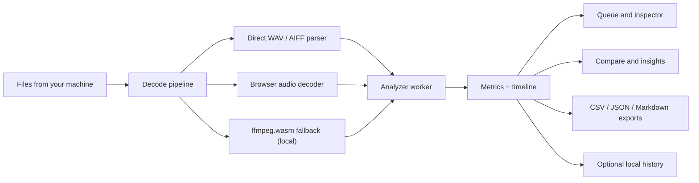

<div align="center">
  
  <h1>TruePeak</h1>
  <p>A loudness and true peak review tool that runs entirely in your browser. Load your audio, read the numbers, compare a batch, and export the results. Nothing is uploaded anywhere.</p>

  <p>
    <a href="https://true-peak.vercel.app/">
      
    </a>
  </p>

  <p>
    
    
    
    
    
    
  </p>
</div>

> **Note**
>
> TruePeak is a review tool, not a certified broadcast compliance meter. WAV and AIFF are read directly. Compressed formats are decoded by the browser or by a local copy of ffmpeg.wasm, and codec behaviour can vary a little between browsers. Use it to check your work, not to sign off a broadcast deliverable.

TruePeak keeps the whole loudness review in one place. Instead of jumping between a meter, a normalization calculator, a file inspector, and a comparison sheet, you get the batch queue, per file detail, timeline charts, target checks, and exports in the same screen. The measurements follow ITU-R BS.1770 and EBU R128.

**Live app:** [true-peak.vercel.app](https://true-peak.vercel.app/)

## Contents

- [What it does](#what-it-does)
- [Supported files and how they are decoded](#supported-files-and-how-they-are-decoded)
- [Modes and workflows](#modes-and-workflows)
- [Theme](#theme)
- [History and session files](#history-and-session-files)
- [Exports](#exports)
- [Privacy](#privacy)
- [Architecture](#architecture)
- [Tech stack](#tech-stack)
- [Getting started](#getting-started)
- [Scripts](#scripts)
- [Testing](#testing)
- [Deploying to Vercel](#deploying-to-vercel)
- [Project structure](#project-structure)
- [Working with large libraries](#working-with-large-libraries)
- [Limitations](#limitations)

## What it does

- Integrated LUFS, ungated loudness, and loudness range (LRA)
- Momentary and short term loudness over time, drawn as a timeline chart
- True peak (4x oversampled) and sample peak
- Targeted checks against a delivery preset or your own custom target, with a suggested gain move and a projected true peak after that move
- A measure only mode that just reports the readings with no target attached
- A compare view for a whole batch: ranked cards, deltas against a reference file, a status board, and a dense table
- A file inspector with overview, timeline, and technical tabs
- Light and dark themes
- Optional local history of finished readings, off by default
- Exports to CSV, JSON, and a Markdown report
- Session files you can save and reopen later

## Supported files and how they are decoded

Input formats: WAV, RF64, AIFF, AIFC, MP3, AAC and M4A, FLAC, OGG, and Opus.

There are three decode routes, picked automatically based on the file and what your browser supports:

1. Direct parsing for WAV, RF64, AIFF, and AIFC. This is the fastest path and does no transcoding.
2. The browser audio decoder for formats it can handle natively.
3. A local copy of ffmpeg.wasm as a compatibility fallback for anything the first two routes do not cover.

If a file cannot be read by any route, the file is marked as failed with a plain message that suggests what to try next, and the rest of the batch keeps going.

## Modes and workflows

**Targeted** compares the measured loudness against a delivery target. You pick a preset or enter your own loudness target and true peak ceiling. The app shows how far the file sits from the target, the gain move that would get it there, the projected true peak after that move, and a verdict (on target, needs gain, too hot, or ceiling limited).

**Measure only** drops the target and just reports loudness, peaks, range, and the timeline. Use it when you want raw readings without any delivery framing.

**Simple** is the default workflow. Drop files in, scan the whole batch in a table, open one file at a time, and export. This covers the common case.

**Advanced** keeps the same session but adds the compare and insights tabs, which help once a session grows past a quick one file check.

## Theme

Light and dark themes are both supported. The choice is stored in a cookie and read on the server, so the correct theme is in the very first response and there is no flash of the wrong colors on load. The default is dark, and the toggle sits in the header.

## History and session files

These are two separate things.

**Local history** is off by default. Turn it on and finished readings are saved as small summary cards in this browser only. It keeps the most recent 20. It is a quick recall list, not a full session restore, and it never leaves your machine.

**Session files** let you save the current results to a `.truepeak.json` file and reopen them later, on this machine or another one. A reopened session shows the readings and the timeline charts in a view only state. The original audio is not stored in the file, so reopened files cannot be analyzed again, retried, or pointed at a new target. Imported entries are marked with a badge. Import is strict: a malformed or untrusted file is rejected with a clear message.

## Exports

Completed results export to three formats:

- `truepeak-analysis.csv`
- `truepeak-analysis.json`
- `truepeak-analysis.md`

The CSV escapes quotes, commas, and line breaks correctly and neutralizes values that a spreadsheet might otherwise treat as a formula. The Markdown file reads like a short technical handoff rather than a raw dump.

## Privacy

Everything happens in the browser. Your files are read locally, decoded locally, and analyzed locally. No audio is uploaded, and there is no backend database or account system. The only thing the server does is read the theme cookie so the first paint uses the right colors.

## Architecture

The app behaves like a review desk rather than an upload dashboard. You bring files in from your machine, the browser does the work in background workers, and one screen holds the queue, the detail view, the compare state, and the exports.



Decoding and analysis run in Web Workers so the heavy math stays off the main thread and the interface stays responsive. Files are processed one at a time. The decoded audio for a file is released before the next one starts, so memory use is set by your largest single file, not by the size of the whole batch.

## Tech stack

| Area | Choice |
| --- | --- |
| Framework | Next.js 16 (App Router) |
| UI | React 19 |
| Styling | Tailwind CSS 4 |
| Charts | uPlot |
| Audio decode | Browser decoder plus `@ffmpeg/ffmpeg` and `@ffmpeg/core` |
| Workers | Web Workers for decode and analysis |
| Icons | Lucide |
| Analytics | Vercel Analytics and Speed Insights, only when deployed on Vercel |

## Getting started

The app is hosted at [true-peak.vercel.app](https://true-peak.vercel.app/), so you can use it without installing anything. To run it locally:

You need Node.js 24 or newer (the build runs on 20+, but the test scripts use Node's native TypeScript support, which needs 24) and npm.

Install dependencies:

```bash
npm install
```

This also copies the ffmpeg assets into `public/vendor/ffmpeg` through a postinstall step.

Start the dev server:

```bash
npm run dev
```

Open http://localhost:3000.

A good first run: leave it in Simple mode, add a few WAV or AIFF files, pick Targeted if you want delivery guidance or Measure only if you just want readings, scan the table, then open a file in the inspector. Switch to Advanced if you want compare and insights.

## Scripts

| Script | What it does |
| --- | --- |
| `npm run dev` | Start the local dev server |
| `npm run build` | Production build |
| `npm run start` | Run the production build locally |
| `npm run lint` | Run ESLint |
| `npm run prepare:ffmpeg` | Copy the ffmpeg assets into `public/vendor/ffmpeg` |
| `npm test` | Run the full validation suite (see below) |
| `npm run test:dsp` | Reference signal checks for the DSP engine |
| `npm run test:ebu` | EBU Tech 3341 and 3342 compliance checks |
| `npm run test:session` | Session file round trip and rejection checks |
| `npm run test:robustness` | Bad and adversarial input checks |
| `npm run test:export` | CSV, JSON, and Markdown export checks |

## Testing

`npm test` runs 94 checks across five harnesses in `scripts/dsp/`:

- **DSP (15):** measures known reference signals and confirms the readings against values you can work out by hand. A 1 kHz sine at minus 6 dBFS reads about minus 6 LUFS, an inter sample peak is recovered above the sample peak, a 6 dB step gives an LRA near 6, and so on.
- **EBU compliance (9):** runs the published test cases from EBU Tech 3341 and 3342 and confirms the meter lands inside the standard's tolerances.
- **Session files (18):** builds a session file, reads it back, and confirms every field survives. It also confirms that malformed or untrusted files are rejected.
- **Robustness (28):** feeds garbage to the parser and analyzer (random bytes, truncated headers, zero channels, a huge channel count, NaN samples, mismatched channels, and so on) and confirms each one fails cleanly, with a sane error or finite output, and never hangs.
- **Export (24):** confirms the CSV escaping and formula neutralization, that only finished jobs are included, and that empty input is handled.

The scripts run the real TypeScript source directly through Node, with a small loader that maps the `@/` path alias. That is why they need Node 24.

## Deploying to Vercel

The current build is live at [true-peak.vercel.app](https://true-peak.vercel.app/). To deploy your own copy:

1. Push the repository to GitHub.
2. Import the project into Vercel.
3. Deploy.

Notes:

- It is a normal Next.js app and needs no special configuration.
- The only server side work is reading the theme cookie. All analysis runs in the browser.
- `public/vendor/ffmpeg` is generated by `npm run prepare:ffmpeg`, which runs automatically on install, dev, and build, so it is not committed.
- No database, auth, environment variables, or custom API are required.

## Project structure

```text
truepeak/
├── app/
│   ├── globals.css
│   ├── layout.tsx
│   ├── manifest.ts
│   └── page.tsx
├── public/
│   ├── favicon.png
│   ├── logo.png
│   └── vendor/ffmpeg/        (generated, not committed)
├── scripts/
│   ├── prepare-ffmpeg-assets.mjs
│   └── dsp/                  (validation suites + helpers)
├── src/
│   ├── audio/                (parsers, DSP, targeting, export, persistence)
│   ├── components/           (workspace UI)
│   ├── hooks/                (session + worker orchestration)
│   ├── lib/                  (formatting, selectors, preferences)
│   ├── types/
│   └── workers/              (decoder + analyzer workers)
├── eslint.config.mjs
├── next.config.ts
├── package.json
├── postcss.config.mjs
└── tsconfig.json
```

## Working with large libraries

The app handles a few hundred files and high resolution material, with a couple of things worth knowing.

- Files run one at a time, and each file's decoded audio is freed before the next starts. So memory is set by your largest single file, not the total. Finished results keep only compact numbers and a small timeline, so a few hundred of them add up to only tens of megabytes.
- A large high resolution file (for example a 300 MB, 24 bit, 192 kHz track) uses roughly 700 MB to 1 GB of memory for the moment it is being processed, then releases it. That is comfortable on a desktop with 8 GB of RAM or more. On a low memory device or phone it can run the tab out of memory, which loses the batch, so use a desktop for heavy work.
- WAV and AIFF take the fast direct parser. Large compressed files (a big FLAC or M4A) go through ffmpeg.wasm, which has its own memory ceiling, so for very large high resolution files, WAV or AIFF is the safer choice.
- A full library is a long sequential job. Plan for roughly five to ten seconds per heavy high resolution file and less for normal songs. Keep the tab open and stop the machine from sleeping. If you would rather not risk a long unbroken run, add the files in a few smaller batches and export each one.

## Limitations

- The live queue is held in memory and is not restored after a hard refresh. Use a session file if you want to keep results.
- Session files store readings and charts, not the source audio, so a reopened session cannot be analyzed again.
- Local history keeps summary cards only, not full sessions.
- Compressed format behaviour can vary slightly by browser and codec support.
- Shipping ffmpeg.wasm locally adds some weight, in exchange for not depending on a third party runtime fetch.
- This is a review aid. It has been validated against reference signals and the EBU test cases, but it is not a certified compliance meter.
