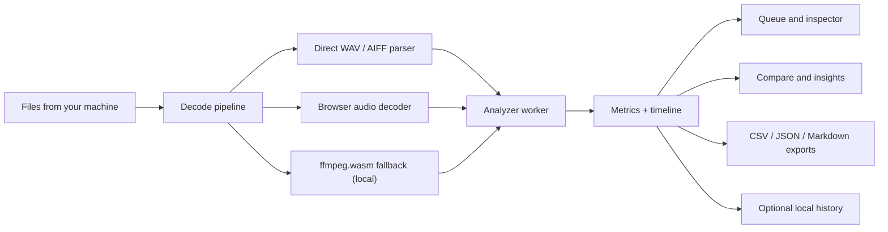

<div align="center">
  
  <h1>TruePeak</h1>
  <p>A loudness and true peak review tool that analyzes audio in your browser. Load your audio, read the numbers, compare a batch, and export the results. TruePeak has no audio-upload path.</p>

  <p>
    <a href="https://true-peak.vercel.app/">
      
    </a>
  </p>

  <p>
    
    
    
    
    
    
  </p>
</div>

> **Note**
>
> TruePeak is a review tool, not a certified broadcast compliance meter. WAV and AIFF are read directly. Compressed formats are decoded by the browser or by a local copy of ffmpeg.wasm, and codec behavior can vary a little between browsers. Use it to check your work, not to sign off a broadcast deliverable.

TruePeak keeps the whole loudness review in one place. Instead of jumping between a meter, a normalization calculator, a file inspector, and a comparison sheet, you get the batch queue, per file detail, timeline charts, target checks, and exports in the same screen. The measurement engine implements ITU-R BS.1770/EBU R128-oriented loudness and true-peak processing and is checked against a documented subset of published EBU reference cases.

**Live app:** [true-peak.vercel.app](https://true-peak.vercel.app/)

## Contents

- [What it does](#what-it-does)
- [Supported files and how they are decoded](#supported-files-and-how-they-are-decoded)
- [Modes and workflows](#modes-and-workflows)
- [Theme](#theme)
- [History and session files](#history-and-session-files)
- [Exports](#exports)
- [Privacy](#privacy)
- [Security](#security)
- [Architecture](#architecture)
- [Tech stack](#tech-stack)
- [Getting started](#getting-started)
- [Scripts](#scripts)
- [Testing](#testing)
- [Deploying to Vercel](#deploying-to-vercel)
- [Project structure](#project-structure)
- [Working with large libraries](#working-with-large-libraries)
- [Limitations](#limitations)

## What it does

- Integrated LUFS, ungated loudness, and loudness range (LRA)
- Momentary and short term loudness over time, drawn as a timeline chart
- True peak (4x oversampled) and sample peak
- Targeted checks against a delivery preset or your own custom target, with a suggested gain move and a projected true peak after that move
- A measure only mode that just reports the readings with no target attached
- Drag and drop that works on every screen, including whole folders (they are scanned for supported audio), with a live batch progress bar and a rough estimate of the time remaining while a run is going
- A compare view for a whole batch: ranked cards, deltas against a reference file, a status board, and a dense table
- A file inspector with overview, timeline, and technical tabs
- Light and dark themes
- Optional local history of finished readings, off by default
- Exports to CSV, JSON, and a Markdown report
- Session files you can save and reopen later

## Supported files and how they are decoded

Input formats: WAV, RF64, AIFF, AIFC, MP3, AAC and M4A, FLAC, OGG, and Opus.

There are three decode routes, picked automatically based on the file and what your browser supports:

1. Direct parsing for WAV, RF64, AIFF, and AIFC. This is the fastest path and does no transcoding.
2. The browser audio decoder for formats it can handle natively.
3. A local copy of ffmpeg.wasm as a compatibility fallback for anything the first two routes do not cover.

If a file cannot be read by any route, the file is marked as failed with a plain message that suggests what to try next, and the rest of the batch keeps going.

## Modes and workflows

**Targeted** compares the measured loudness against a delivery target. You pick a preset or enter your own loudness target and true peak ceiling. The app shows how far the file sits from the target, the gain move that would get it there, the projected true peak after that move, and a verdict (on target, needs gain, too hot, or ceiling limited). Which true peak the verdict judges depends on what you would do with the file. Inside the loudness tolerance you ship it as measured, so a measured peak over the ceiling reads as ceiling limited rather than on target. Outside the tolerance you would apply the suggested gain first, so the verdict judges the peak that move would leave behind. A quiet file reads ceiling limited whenever its peak is already over, because adding gain only pushes it further past. A too hot file reads too hot when attenuating to target also brings the peak back inside, and ceiling limited when it does not, which happens whenever the peak is further over the ceiling than the loudness is over target. The peak check runs on every gain policy, not only the ones that cap the move, and the tolerance the verdict uses is exactly the one you entered, including values under 0.1 LU.

**Measure only** drops the target and just reports loudness, peaks, range, and the timeline. Use it when you want raw readings without any delivery framing.

**Simple** is the default workflow. Drop files in, scan the whole batch in a table, open one file at a time, and export. This covers the common case.

**Advanced** keeps the same session but adds the compare and insights tabs, which help once a session grows past a quick one file check.

## Theme

Light and dark themes are both supported. The choice is stored in a cookie and read on the server, so the correct theme is in the very first response and there is no flash of the wrong colors on load. The default is dark, and the toggle sits in the header.

## History and session files

Three related things, with different jobs.

**Live session restore** is automatic when IndexedDB is available. Completed results are mirrored into this browser as they finish. Saves, retries, deletes, and Clear Session are serialized; the app reports a persistent warning if the browser blocks storage or a transaction cannot be committed. Restored results are view only because the source audio does not survive a reload. The current target, analysis mode, custom target fields, and decoder preference are restored before results are reconciled. If those settings cannot be committed to localStorage, the app keeps a persistent warning and stops adding new results to recovery so a reload cannot silently combine them with stale settings. Removing a file still updates its existing recovery copy, and Clear Session reports success only after deletion commits; it also empties this tab's quarantined records, which are the recovery rows that failed validation during a restore. With several tabs open at once, each tab owns its recovery copies: restore surfaces everything it can read, but one tab clearing its session leaves the other tabs' copies alone.

**Local history** is off by default. Turn it on and finished readings are saved as small summary cards in this browser only. It keeps the most recent 20. Turning history off stops new summaries but does not delete existing ones; the count and clear control remain available. Migrated legacy summaries are marked when their original validity/provenance contract is unknown. It is a quick recall list, not a full session restore, and it never leaves your machine.

**Session files** let you save the current results to a versioned `.truepeak.json` file and reopen them later, on this machine or another one. The original audio is not stored, so imported entries are view only and are always labelled as unverified imports; trusted/compliance use requires re-analysis from source audio. The importer hashes the source session, assigns fresh local IDs, retains bounded lineage, validates the entire file in a worker, and rejects a malformed or inconsistent file atomically rather than loading a partial review. Oversized exports fail explicitly, and long timelines are downsampled without changing headline measurements so exported files remain portable.

## Exports

Completed results export to three formats, each stamped with the export time so repeated exports never overwrite each other. The stamp has one-second resolution, so a second export of the same kind inside one second gains a `-2`, `-3`, and so on. The counter is per filename family: exporting CSV and then JSON in the same second gives both the plain stamp, because their extensions already differ.

- `truepeak-analysis-YYYYMMDD-HHMMSS.csv`
- `truepeak-analysis-YYYYMMDD-HHMMSS.json`
- `truepeak-analysis-YYYYMMDD-HHMMSS.md`

Session saves and timeline CSVs follow the same pattern, each with its own counter (`truepeak-session-YYYYMMDD-HHMMSS.truepeak.json`, `truepeak-timeline-YYYYMMDD-HHMMSS.csv`). The CSV escapes quotes, commas, and line breaks correctly, neutralizes values that a spreadsheet might otherwise treat as a formula, and starts with a UTF-8 byte-order mark so Excel reads accented filenames correctly. The Markdown file reads like a short technical handoff rather than a raw dump.

## Privacy

Audio bytes, decoded PCM, measurements, session recovery data, and optional history remain in your browser; TruePeak has no audio-upload API, account system, or server-side application database. This app does not send usage analytics unless the deployment operator has explicitly enabled them; audio and results are never included, even then. Telemetry is off by default everywhere. Vercel Analytics and Speed Insights mount only when the build runs on Vercel (`VERCEL=1`) and the operator also sets `NEXT_PUBLIC_ENABLE_TELEMETRY=1`; a default Vercel deployment with that flag unset sends nothing. The server reads the theme cookie, which also makes the public route dynamically rendered.

## Security

Untrusted input (audio files and imported session files) goes through strict, capped validation, and a fuzzer checks those same paths on every push. Responses carry a tight Content Security Policy and related headers. The ffmpeg.wasm runtime is pinned to known fingerprints at build time, and CI fails when a runtime dependency carries a serious known advisory. The threat model, the protections, the accepted risks, and how to report a problem are all documented in [SECURITY.md](./SECURITY.md).

## Architecture

The app behaves like a review desk rather than an upload dashboard. You bring files in from your machine, the browser does the work in background workers, and one screen holds the queue, the detail view, the compare state, and the exports.



Direct container decoding, compatibility decoding, and analysis run in Web Workers. The browser-codec route necessarily uses Web Audio on the page's main realm; cancellation becomes visible immediately, but the scheduler retains that file's lane until the browser's uninterruptible `decodeAudioData()` work has actually drained. Every route receives the same source, channel, frame, duration, decoded-byte, output-byte, and execution-time budget. Before admitting work, the queue reserves aggregate modeled route residency: browser decoding counts both the `AudioBuffer` and its planar copy, while compatibility decoding counts both float-WAV output and parsed planar PCM. Known-footprint files reserve twice their decoded bytes and share the aggregate; unknown-footprint media holds a full conservative reservation (large opaque files run alone), capped/truncated decoder output is rejected, and messages from stale worker generations are ignored. Two further safeguards sit under that model. Browser decodes pass through a small fixed window (two at a time on capable devices, one elsewhere), because `decodeAudioData()` allocates its output before the result can be checked and a batch of misdeclared files must not multiply that allocation across every lane. And when a decoder fallback needs a larger reservation than the aggregate can grant at that moment, the job returns to the queue and retries once capacity frees, instead of failing. Idle workers are shut down after the queue goes quiet.

## Tech stack

| Area | Choice |
| --- | --- |
| Framework | Next.js 16 (App Router) |
| UI | React 19 |
| Styling | Tailwind CSS 4 |
| Charts | uPlot |
| Audio decode | Browser decoder plus `@ffmpeg/ffmpeg` and `@ffmpeg/core` |
| Workers | Web Workers for decode and analysis |
| Icons | Lucide |
| Analytics | Vercel Analytics and Speed Insights, off by default, mounted only on Vercel with `NEXT_PUBLIC_ENABLE_TELEMETRY=1` |

## Getting started

The app is hosted at [true-peak.vercel.app](https://true-peak.vercel.app/), so you can use it without installing anything. To run it locally:

You need Node.js 24 or newer (`package.json` declares `engines.node >= 24`) and npm. The application build runs on Node 20+, but the test scripts use Node's native TypeScript support, which needs 24.

Install dependencies:

```bash
npm install
```

This also copies the ffmpeg assets into `public/vendor/ffmpeg` through a postinstall step.

Start the dev server:

```bash
npm run dev
```

Open http://localhost:3000.

A good first run: leave it in Simple mode, add a few WAV or AIFF files (drop them anywhere, folders included), pick Targeted if you want delivery guidance or Measure only if you just want readings, scan the table, then open a file in the inspector. Switch to Advanced if you want compare and insights. Two keyboard shortcuts: `/` focuses the queue search and `Ctrl/Cmd+O` opens the file picker.

## Scripts

| Script | What it does |
| --- | --- |
| `npm run dev` | Start the local dev server |
| `npm run build` | Production build |
| `npm run start` | Run the production build locally |
| `npm run lint` | Run ESLint |
| `npm run prepare:ffmpeg` | Copy the ffmpeg assets into `public/vendor/ffmpeg` |
| `npm test` | Run the full validation suite (see below) |
| `npm run test:dsp` | Reference signal checks for the DSP engine |
| `npm run test:ebu` | EBU Tech 3341/3342 reference-subset checks |
| `npm run test:session` | Session file round trip and rejection checks |
| `npm run test:robustness` | Bad and adversarial input checks |
| `npm run test:export` | CSV, JSON, and Markdown export checks |
| `npm run test:presets` | Delivery preset and custom-target validation checks |
| `npm run test:live-session` | Cross-tab persistence, clear/save ordering, and provenance recovery checks |
| `npm run test:runtime` | Decoded-resource budget, cancellation draining, and bounded folder traversal checks |
| `npm run test:fuzz` | Seeded fuzz cases over every untrusted-input parser |

## Testing

`npm test` runs 629 fixed assertions plus 1,362 deterministic fuzz cases across nine harnesses in `scripts/dsp/`:

- **DSP:** measures known reference signals, validity boundaries, channel weighting (including the maskless fallbacks agreeing with the speaker-mask path), peak/timeline invariants, repeatability, and targeting/compliance behavior.
- **EBU reference subset:** reproduces the published EBU Tech 3341 and 3342 cases that can be synthesized from their documented parameters, and asserts the standards' own expected readings. It runs 17 of the 23 Tech 3341 cases and 4 of the 6 Tech 3342 cases. The rest (Tech 3341 cases 7, 8, and 20 to 23, and Tech 3342 cases 5 and 6) need the EBU reference-audio downloads or 4x-fs synthesis and are not reproduced. Passing this subset is not EBU certification.
- **Session files:** exercises v2 round trips, v1 compatibility, provenance, full-file atomic rejection, cross-field invariants, aggregate timeline limits, UTF-8 size limits, and portable downsampling.
- **Robustness:** feeds malformed parser/analyzer inputs, unsupported rates, RF64/AIFC edge cases, duplicate-chunk containers that would otherwise decode geometry the preflight never saw, and hostile resource declarations through fail-closed paths.
- **Export:** checks measurement-validity wording, provenance, CSV formula neutralization, Markdown/HTML structure escaping, selectors, and the timestamped filename contract including same-second collisions.
- **Presets:** checks the delivery presets and the custom-target flow, covering field validation, range boundaries, modified/reset state, and round trips.
- **Live session:** exercises persistence races, clear/save ordering, cross-tab ownership and heartbeat refresh, quarantine cleanup, and provenance recovery for the IndexedDB-backed live session store.
- **Runtime:** exercises decoded-resource budgets, container preflight against inconsistent header geometry, reservation contention handling, the browser-decode window, FLAC footprint corroboration, cancellation draining, and bounded folder traversal.
- **Fuzz (1,362 cases):** a seeded, reproducible fuzzer mutates valid WAV, AIFF, FLAC, and session files, feeds in raw noise as well, and runs all of it through every parser that touches untrusted bytes. Each case has to fail cleanly or produce sane output inside a time budget. The seed is fixed, so any failure reproduces exactly.

The live session and runtime harnesses (`validate-live-session.mjs` and `validate-runtime.mjs`) are included in `npm test` like the rest, but can also be run directly with Node when you only want that one suite.

The scripts run the real TypeScript source directly through Node, with a small loader that maps the `@/` path alias. That is why they need Node 24.

## Deploying to Vercel

The current build is live at [true-peak.vercel.app](https://true-peak.vercel.app/). To deploy your own copy:

1. Push the repository to GitHub.
2. Import the project into Vercel.
3. Deploy.

Notes:

- It is a normal Next.js app and needs no special configuration.
- Social preview and canonical URLs (`metadataBase`, Open Graph, Twitter card) resolve from `NEXT_PUBLIC_SITE_URL` if set, otherwise from Vercel's auto-injected `VERCEL_URL`, otherwise from the canonical deployment above. Set `NEXT_PUBLIC_SITE_URL` on your own fork if you want shared links to point at your custom domain instead of the deployment URL.
- The server reads the theme cookie, so `/` is dynamically rendered; all audio decoding and analysis still runs in the browser.
- Analytics and Speed Insights are off by default. They mount only when the build runs on Vercel (`VERCEL=1`) and you also set `NEXT_PUBLIC_ENABLE_TELEMETRY=1`. A default Vercel deployment without that flag sends no telemetry.
- `public/vendor/ffmpeg` is generated by `npm run prepare:ffmpeg`, which runs automatically on install, dev, and build, so it is not committed.
- No server-side database, auth, environment variables, or custom API are required; browser recovery uses IndexedDB.

## Project structure

```text
truepeak/
├── app/
│   ├── error.tsx             (styled recovery screen for crashes)
│   ├── globals.css
│   ├── layout.tsx
│   ├── manifest.ts
│   ├── not-found.tsx
│   ├── opengraph-image.png   (social preview card)
│   └── page.tsx
├── public/
│   ├── favicon.png
│   ├── logo.png
│   └── vendor/ffmpeg/        (generated, not committed)
├── scripts/
│   ├── prepare-ffmpeg-assets.mjs
│   └── dsp/                  (validation suites + helpers)
├── src/
│   ├── audio/                (parsers, DSP, targeting, export, persistence)
│   ├── components/           (workspace UI)
│   ├── hooks/                (session + worker orchestration)
│   ├── lib/                  (formatting, selectors, preferences)
│   ├── types/
│   └── workers/              (decoder + analyzer workers)
├── eslint.config.mjs
├── next.config.ts
├── package.json
├── postcss.config.mjs
└── tsconfig.json
```

## Working with large libraries

The scheduler uses decoded footprint rather than compressed file size. Container metadata is preflighted from a bounded header slice where it is trustworthy (PCM WAV/AIFF and FLAC, including large masters), so several known-footprint files analyze in parallel when their combined reservations fit the device's aggregate budget. A FLAC header whose declared footprint cannot account for the file's own size is not trusted; the file falls back to the conservative reservation instead. Files without a defensible pre-decode footprint hold a conservative reservation instead, which allows two at once on capable devices and one elsewhere. Each decode is bounded by source bytes, decoded bytes, output bytes, channels, frames, duration, and elapsed time, and the compatibility path rejects any capped or inconsistent output instead of analyzing a truncation. The aggregate reservation is reduced on memory-constrained devices.

One session holds at most 1,000 jobs, and the same limit applies everywhere: intake, recovery restore, portable export, and portable import. Intake counts every job already in the session, so a run of adds can never push the total past 1,000; files beyond the remaining room are turned away and reported rather than dropped silently. An over-limit session export fails explicitly, an over-limit import is rejected rather than truncated, and recovery restores the newest 1,000 records while leaving any extra stored records in place. Recovery reads IndexedDB schema v2: the restore walks a newest-first index, and a record that fails validation is moved to a quarantine store rather than deleted. Folder drops stop during enumeration at file, entry, depth, page, and time budgets (2,000 files, 8,000 entries, depth 12, 256 pages, 5 seconds); those are a traversal safeguard, separate from the 1,000-job session limit.

Parallel lanes still improve normal desktop batches, but browser codec support and memory behavior vary. On codecs without trustworthy pre-decode metadata, Web Audio can allocate its output before TruePeak can verify the result; those decodes go through the fixed browser-decode window described above, every result is validated before copying or analysis, and a canceled decode is drained before its lane is reused. For unusually heavy libraries, smaller batches plus regular session exports remain the safest workflow.

## Limitations

- Completed results are restored automatically after a refresh (marked with a Restored badge), but files that were still queued or running are not: the browser cannot keep file handles across a reload, so unfinished work has to be added again.
- Restored results and session files store readings and charts, not the source audio, so they cannot be analyzed again.
- Local history keeps summary cards only, not full sessions.
- Automatic recovery depends on browser IndexedDB. Storage failures are reported, but a downloaded session file is the portable backup.
- Compressed format behavior can vary slightly by browser and codec support.
- Telemetry is off by default. Analytics and Speed Insights send visit and performance data only when the build runs on Vercel with `NEXT_PUBLIC_ENABLE_TELEMETRY=1`; audio and measurement content are never sent through those integrations.
- The EBU harness is a reference subset, not certification. The earlier DSP and parser gaps are now handled (WAVE quad-mask weighting, 400 ms validity at odd rates such as 11,025 Hz, trailing-silence LRA, RF64 declared-size handling, and mandatory AIFC conformance). The suite stays a subset because Tech 3341 cases 7, 8, and 20 to 23, and Tech 3342 cases 5 and 6, need EBU reference-audio downloads or 4x-fs synthesis, so passing it is not a standards conformance guarantee.
- **Measurement limitations:** the K-weighting filter is re-derived per sample rate with a pre-warped bilinear transform, which matches the 48 kHz reference response almost exactly at normal delivery rates but steepens near Nyquist at low sample rates. For programme sampled below roughly 24 kHz with substantial energy in its top octave, integrated/momentary/short-term loudness can read up to about 0.4 LU higher than the same audio would measure at 48 kHz (for example, roughly +0.42 LU at 8 kHz and +0.15 LU at 16 kHz for a top-octave-heavy signal). 44.1 kHz and 48 kHz and above are effectively unaffected (well under 0.01 LU). True peak measurement is not affected.
- Shipping ffmpeg.wasm locally adds some weight, in exchange for not depending on a third party runtime fetch.
- This is a review aid. It has been validated against reference signals and a documented subset of EBU cases, but it is not a certified compliance meter.
