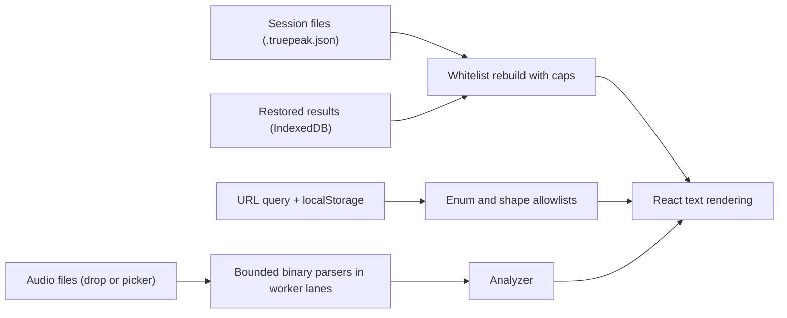

<div align="center">
  
  <h1>Security</h1>
  <p>How TruePeak handles untrusted input, what protects the app and your data, which risks are accepted on purpose, and how to report a problem.</p>

  <p>
    <a href="https://github.com/rsvptr/truepeak/actions/workflows/ci.yml">
      
    </a>
    
    
  </p>
</div>

> **Note**
>
> TruePeak runs entirely in your browser. Your audio is read, decoded, and analyzed on your own machine. There is no upload path, no backend database, and no account system, so there is no audio or user data sitting on a server to steal in the first place. The work described below is about the inputs the app does accept, and about making sure the code you run is the code that was reviewed.

The short version: every parser that touches untrusted bytes is bounded, validated, and fuzzed. The pages ship with a strict Content Security Policy and related headers. The one large piece of third party code is pinned by fingerprint at build time. And CI checks all of it again on every push. The rest of this document walks through each layer, then states the accepted risks plainly.

## Contents

- [The security model](#the-security-model)
- [What an attacker could try](#what-an-attacker-could-try)
- [How untrusted input is handled](#how-untrusted-input-is-handled)
- [Limits on untrusted input](#limits-on-untrusted-input)
- [Headers the pages ship with](#headers-the-pages-ship-with)
- [What is stored where](#what-is-stored-where)
- [Supply chain](#supply-chain)
- [Continuous verification](#continuous-verification)
- [Check it yourself](#check-it-yourself)
- [Accepted risks](#accepted-risks)
- [Reporting a vulnerability](#reporting-a-vulnerability)

## The security model

Everything interesting happens on your machine. The only server side work in the whole app is reading the theme cookie so the first paint uses the right colors. That shapes the threat model in a useful way: there is no data flow between users, so nothing a hostile file does can affect anyone except the person who opened it.

What is worth defending, then, is the browser session itself. An attacker should not be able to run script in the app's origin, crash or hang the tab, quietly corrupt your stored results, or swap the code the app ships for something unreviewed.

## What an attacker could try

Untrusted input reaches TruePeak in three ways, and each one goes through its own validation layer before anything else sees it:



1. **Audio files** you open or drop: WAV, RF64, AIFF, AIFC, and the compressed formats. These go to hand written binary parsers, the browser's own decoder, or a locally served copy of ffmpeg.wasm.
2. **Session files** (`.truepeak.json`) you import, which may have been made by someone else. The app's own saved results, read back from IndexedDB after a refresh, are deliberately treated with the same suspicion.
3. **The URL query string and localStorage**, which hold workspace state and preferences.

The realistic attacker goals are running script in the app's origin (XSS), denial of service against the tab (hangs, memory exhaustion, crashes), and substituting the shipped code (supply chain). Each section below maps to one of those.

## How untrusted input is handled

**Audio files.** The WAV and AIFF parsers bound every allocation by the actual size of the buffer they were handed, so a header that declares an absurd size cannot cause an absurd allocation. The chunk scanners track only the chunk IDs they actually read and stop scanning once those are found. That closes off a real problem fixed during review: a file made of millions of tiny junk chunks used to balloon memory before a single audio byte was parsed. Format fields are also checked for the values binary formats can sneak past simple comparisons. The AIFF sample rate, for example, is an 80 bit float that can encode NaN and Infinity, both of which pass a naive check against zero and are now rejected outright. Anything that fails turns into a plain error message, and the rest of the batch keeps going.

**Worker isolation.** Decoding and analysis run in Web Workers, one independent decoder and analyzer pair per active file. A file that manages to crash a worker takes down only its own lane, which is terminated and replaced automatically. It cannot touch a neighbouring file's work or the page itself. ffmpeg.wasm runs inside one of those workers and loads assets only from the app's own origin.

**Session files and restored results.** Imports are not trusted and then checked. They are rebuilt. Every field the app will ever read is checked for type, capped for length and count, and copied into a fresh object, so unknown fields and wrong values never exist on the other side. A URL embedded in a session file is kept only if it is plain `http` or `https`. The same validation runs on the app's own IndexedDB records when a session is restored after a refresh. IndexedDB lives in the same origin, but treating stored bytes as trusted is how corruption turns into a crash, so they get the full rebuild too. A malformed file is rejected with a clear message rather than a broken screen.

**The URL and localStorage.** Workspace state in the query string (the active tab, filters, sort, and so on) is matched against fixed lists of allowed values. An unknown value falls back to a default rather than reaching any logic. Preferences read from localStorage are validated the same way, and stored history entries have their shape checked before use.

**Rendering and exports.** Untrusted strings only ever render through React text interpolation, which escapes them. The app uses no raw HTML injection for user data; the single inline script in the page is a fixed theme snippet that takes no input. On the way out, the CSV export escapes quotes, commas, and line breaks, and it neutralizes anything a spreadsheet would treat as a formula (`=`, `+`, `-`, `@`, tabs, newlines), so a hostile filename cannot become an executing cell in Excel.

## Limits on untrusted input

Caps keep a hostile or simply enormous input from becoming a memory problem. These are the enforced numbers, straight from the source:

| Input | Limit |
| --- | --- |
| Session file size | 64 MB per import |
| Jobs per session file | 1,000 |
| Timeline points per result | 500,000 |
| Short strings (names, labels) | 512 characters |
| Long strings (notes, descriptions) | 2,000 characters |
| Notes and warnings per result | 64 entries |
| Files accepted per add | 2,000 |
| Folder traversal depth on drop | 12 levels |

When a cap cuts something off, the app says so in a notice instead of pretending it covered everything.

## Headers the pages ship with

Every response carries a defensive header set. The Content Security Policy matters most: it blocks every external script, style, and connection origin, which closes the usual exfiltration route even if markup injection were ever found.

| Header | Value (production) | What it prevents |
| --- | --- | --- |
| `Content-Security-Policy` | `default-src 'self'` with `script-src 'self' 'unsafe-inline' 'wasm-unsafe-eval' blob:`, workers, media, and connections restricted to `'self' blob:`, `object-src 'none'`, `frame-ancestors 'none'`, `upgrade-insecure-requests` | Loading script from, or sending data to, anywhere external |
| `X-Frame-Options` and `frame-ancestors` | `DENY` and `'none'` | Clickjacking inside an iframe |
| `X-Content-Type-Options` | `nosniff` | MIME type confusion |
| `Referrer-Policy` | `strict-origin-when-cross-origin` | Leaking URLs to other sites |
| `Cross-Origin-Opener-Policy` | `same-origin` | Window handle attacks from popups |
| `Permissions-Policy` | camera, microphone, geolocation, payment, and USB all disabled; the screen wake lock allowed for the app itself | Quiet use of sensitive browser features |

Production drops `'unsafe-eval'` entirely. `'wasm-unsafe-eval'` is just enough for ffmpeg.wasm to compile, and that exact path is exercised in testing under the production policy. Development keeps `'unsafe-eval'` for the bundler's hot reload and nothing else.

## What is stored where

Nothing leaves your machine. This is what stays on it, and how to remove it.

| Store | What lives there | Cleared by |
| --- | --- | --- |
| Cookie (`truepeak-theme`) | Light or dark, kept for one year, `SameSite=Lax`, `Secure` over HTTPS | Switching themes or clearing cookies |
| localStorage | UI preferences, and the optional history summaries (off by default, most recent 20) | The Clear History control or clearing site data |
| IndexedDB | Completed results for the live session, so a refresh does not lose a finished batch | Removing files, Clear Session, or clearing site data |

## Supply chain

The largest piece of third party code the app serves to users is the ffmpeg.wasm runtime, so it gets the most careful handling. The build copies it from the installed package only after checking its SHA-256 fingerprints against values pinned in [`scripts/prepare-ffmpeg-assets.mjs`](./scripts/prepare-ffmpeg-assets.mjs). A package that does not match, whether that is a hijacked release, a tampered download, or simply an unreviewed version, stops the build and prints both fingerprints, so it never reaches a browser. Upgrading it is a deliberate, manual step: install, review, run the script with `--print-hashes`, and pin the new values.

Around that sit the usual guards. `package-lock.json` pins the whole dependency tree. Dependabot proposes routine updates weekly, with `@ffmpeg/core` deliberately excluded, because an automated bump of that package can only ever produce a failed build until a person reviews and pins it. And CI fails any push whose dependencies carry a serious known advisory.

## Continuous verification

Security claims drift out of date unless something checks them again. Two things do.

**The fuzzer.** `npm run test:fuzz` runs roughly 1,360 deterministic cases against every parser that touches untrusted bytes: mutated WAV files across three encodings, mutated AIFF files, raw noise into every binary parser, mutated FLAC headers (that parser runs on the main thread, so it gets fuzzed directly), mutated session JSON, and two regression cases for the exact memory and sample rate bugs found during review. Every case must either parse into sane output or fail with a clean error inside a 250 ms budget. No hangs, no strange throws, no runaway memory. The seed is fixed, so any failure reproduces exactly, anywhere.

**The CI gate.** Every push and pull request runs the install (which executes the ffmpeg fingerprint check), the linter, all six validation suites (the DSP reference signals, the EBU compliance cases, session round trips, bad input robustness, export escaping, and the fuzzer), then a production build and `npm audit --audit-level=high`. The badge at the top of this page is that pipeline's current verdict. The full suite breakdown lives in the [README's testing section](./README.md#testing).

## Check it yourself

None of the above needs to be taken on faith. From a checkout:

```bash
npm install          # runs the ffmpeg fingerprint check as a postinstall step
npm test             # all six suites: 96 fixed checks plus roughly 1,360 fuzz cases
npm run test:fuzz    # just the fuzzer
node scripts/prepare-ffmpeg-assets.mjs --print-hashes   # current ffmpeg fingerprints
```

And against the live deployment:

```bash
curl -sI https://true-peak.vercel.app/ | grep -iE "content-security|frame|referrer|permissions|opener|content-type-options"
```

## Accepted risks

Stated plainly, with the reasoning, so nobody has to rediscover them:

- **`'unsafe-inline'` stays in `script-src`.** Next.js App Router starts up with inline scripts, and removing this requires nonce middleware. External script origins are still fully blocked, which is the part that breaks the usual XSS exfiltration approach.
- **`'unsafe-inline'` stays in `style-src`** for styles the framework injects. Style injection without script execution is a minor vector here.
- **`npm audit` reports moderate advisories for the PostCSS copy bundled inside Next.js's own build tooling.** It processes only this repository's own CSS at build time, cannot be reached at runtime, and the only offered fix is a major Next.js downgrade.
- **Browsers without `navigator.deviceMemory`** (Safari and Firefox) fall back to conservative parallelism rules rather than hard memory guarantees. The gate that makes very large files run alone still applies.

## Reporting a vulnerability

Please report suspected vulnerabilities privately through [GitHub security advisories](https://github.com/rsvptr/truepeak/security/advisories/new) on this repository rather than a public issue. If you can, include the file or input that triggers the problem. The fuzzer uses a fixed seed, so a reproducing input usually becomes a regression test in the same change that fixes it.
