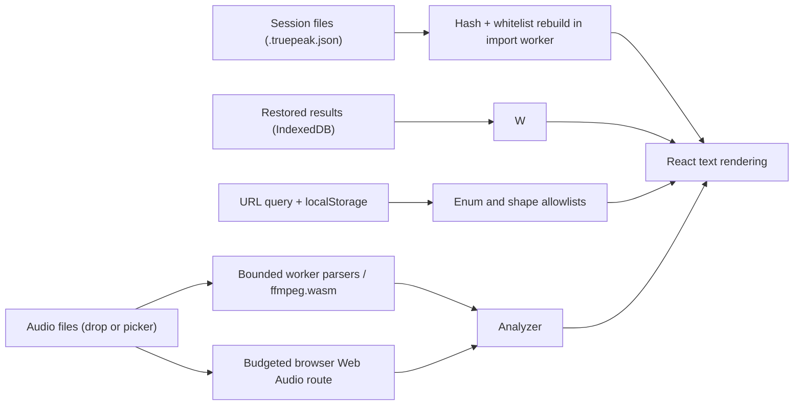

<div align="center">
  
  <h1>Security</h1>
  <p>How TruePeak handles untrusted input, what protects the app and your data, which risks are accepted on purpose, and how to report a problem.</p>

  <p>
    <a href="https://github.com/rsvptr/truepeak/actions/workflows/ci.yml">
      
    </a>
    
    
  </p>
</div>

> **Note**
>
> TruePeak reads, decodes, and analyzes audio on your machine. There is no audio-upload path, server-side application database, or account system; local recovery uses browser IndexedDB. Telemetry is off by default: Analytics and Speed Insights mount only when the build runs on Vercel (`VERCEL=1`) and the operator also sets `NEXT_PUBLIC_ENABLE_TELEMETRY=1`. When that opt-in is on, visit and performance telemetry is the network exception; audio bytes and measurement content are not sent through those integrations. The work below covers untrusted inputs, local persistence, resource exhaustion, and making sure the shipped code is the code that was reviewed.

The short version: parsers and decode routes are bounded, validated, and fuzzed; pages ship with a strict Content Security Policy and related headers; the embedded ffmpeg.wasm bytes are fingerprint-pinned; and CI checks the primary paths on every push. The optional hosted telemetry (off unless explicitly enabled) and the known age of the pinned FFmpeg core are separate trust/accepted-risk boundaries called out below.

## Contents

- [The security model](#the-security-model)
- [What an attacker could try](#what-an-attacker-could-try)
- [How untrusted input is handled](#how-untrusted-input-is-handled)
- [Limits on untrusted input](#limits-on-untrusted-input)
- [Headers the pages ship with](#headers-the-pages-ship-with)
- [What is stored where](#what-is-stored-where)
- [Supply chain](#supply-chain)
- [Continuous verification](#continuous-verification)
- [Check it yourself](#check-it-yourself)
- [Accepted risks](#accepted-risks)
- [Reporting a vulnerability](#reporting-a-vulnerability)

## The security model

Audio processing and result storage happen on your machine. The server reads the theme cookie (making `/` dynamically rendered), and a build only loads same-origin Vercel telemetry endpoints when the operator opts in with `NEXT_PUBLIC_ENABLE_TELEMETRY=1` on Vercel. There is still no application data flow between users, so the main hostile-file impact is confined to the browser session that opened it.

What is worth defending, then, is the browser session itself. An attacker should not be able to run script in the app's origin, crash or hang the tab, quietly corrupt your stored results, or swap the code the app ships for something unreviewed.

## What an attacker could try

Untrusted input reaches TruePeak in three ways, and each one goes through its own validation layer before anything else sees it:



1. **Audio files** you open or drop: WAV, RF64, AIFF, AIFC, and the compressed formats. These go to hand written binary parsers, the browser's own decoder, or a locally served copy of ffmpeg.wasm.
2. **Session files** (`.truepeak.json`) you import, which may have been made by someone else. The app's own saved results, read back from IndexedDB after a refresh, are deliberately treated with the same suspicion.
3. **The URL query string and localStorage**, which hold workspace state and preferences.

The realistic attacker goals are running script in the app's origin (XSS), denial of service against the tab (hangs, memory exhaustion, crashes), and substituting the shipped code (supply chain). Each section below maps to one of those.

## How untrusted input is handled

**Audio files.** The WAV/RF64 and AIFF/AIFC parsers bound field reads and allocations and reject incomplete metadata, including an RF64 data size larger than the physical bytes and an AIFC file missing its mandatory FVER chunk. Before or during every decode route, checked arithmetic enforces source, decoded, output, channel, frame, duration, and time budgets. FFmpeg output is probed before analysis and is rejected if a cap was hit or the decoded frame/byte metadata is inconsistent. Anything that fails becomes a structured, actionable job error while the rest of the batch continues.

**Worker isolation and lane ownership.** Direct/compatibility decoding and analysis run in Web Workers; browser-native codecs use Web Audio in the page realm because that API is not consistently available in workers. Every active job owns an immutable lane lease and worker generation. Stale events are ignored, a worker restart cannot release the lane into another job's hands, and cancellation retains ownership until any uninterruptible browser decode has drained. Synchronous worker-construction failures clean up partially created workers and settle the affected row. ffmpeg.wasm runs in the decoder worker and loads assets only from the app's origin.

**Session files and restored results.** Imports are hashed and rebuilt in a dedicated worker. Every consumed field is checked for type and cross-field consistency, capped for length/count, and copied into a fresh object. One malformed row rejects the whole file, imported IDs are replaced, and a file cannot grant itself trusted provenance or forge the SHA-256 that the app associates with its actual source bytes. Imported results remain explicitly unverified through re-export and IndexedDB recovery. The same whitelist rebuild runs on recovery records, which are read from IndexedDB schema v2. The restore walks a newest-first `createdAt` index and stops at the 1,000-record session limit. A record that fails validation within that newest-first region is moved to a quarantine store rather than deleted; records beyond the limit are left in place and reported as overflow. No record is deleted during a restore, and the read is transactional, so a failed quarantine move rolls back rather than dropping a record without quarantining it.

**Settings/recovery consistency.** Target, mode, custom target fields, and decoder preference are validated before storage. Invalid text drafts never replace the last valid target snapshot. If localStorage refuses the settings write, a persistent warning is shown and new completed results are not added to IndexedDB recovery until a later settings write succeeds; deletes and an explicit Clear Session remain available. This prevents recovery from silently applying stale settings to newly measured results.

**The URL and localStorage.** Workspace state in the query string (the active tab, filters, sort, and so on) is matched against fixed lists of allowed values. An unknown value falls back to a default rather than reaching any logic. Preferences read from localStorage are validated the same way. Stored history is count-, string-, date-, and number-bounded, current envelopes require explicit validity/provenance state, and migrated summaries are marked when the legacy contract is unknown.

**Rendering and exports.** Untrusted strings render through React text interpolation. The app uses no raw HTML injection for user data; the single inline script is a fixed theme snippet. CSV fields are quoted and formula-neutralized, while Markdown report fields escape headings, links/images, HTML, separators, and line breaks so a hostile filename cannot restructure the report. JSON/CSV/Markdown exports prominently label unverified imported provenance. Records carrying the current validity flag never present the internal `-70` invalid-measurement sentinel as a real integrated reading; older records without that flag are explicitly treated as legacy/unknown where that distinction is available.

## Limits on untrusted input

Caps keep a hostile or simply enormous input from becoming a memory problem. These are the enforced numbers, straight from the source:

| Input | Limit |
| --- | --- |
| Session file size | 64 MB per import |
| Jobs per session file | 1,000 |
| Timeline points per portable session | 500,000 aggregate (exports downsample) |
| Short strings (names, labels) | 512 characters |
| Long strings (notes, descriptions) | 2,000 characters |
| Notes and warnings per result | 64 entries |
| Jobs accepted into a running session | 1,000 (whole session, counted across every add, not per add) |
| Source / decoded / decoder-output bytes per job | 512 MiB / 256 MiB / 257 MiB on constrained devices; 1 GiB / 1 GiB / 1,025 MiB on devices reporting 8 GB or more of memory (so 24-bit 192 kHz masters fit); hard ceilings 2 GiB / 1.5 GiB / 1,537 MiB that no caller can raise |
| Aggregate modeled decode-route residency | One or two conservative route peaks, selected from device-memory/pointer signals and derived from the active budget tier. Known footprints (PCM WAV/AIFF headers, FLAC STREAMINFO) reserve twice their decoded bytes so several files can share the aggregate; unknown footprints reserve a full conservative peak, and large unknown sources run alone |
| Channels / duration / decode time | 32 / 6 hours / 2 minutes per job on constrained devices; the large-memory tier allows 4 minutes of decode time |
| Folder traversal | 2,000 files, 8,000 entries, depth 12, 256 pages, 5 seconds |

One authoritative limit of 1,000 jobs now governs intake, recovery restore, portable export, and portable import. Intake counts every job already in the session, so a sequence of adds can never push the total past 1,000; files beyond the remaining room are turned away and reported, not dropped silently. The app fails an over-limit session export explicitly, rejects over-limit imports rather than truncating, and restores the newest 1,000 records while reporting overflow and leaving the extra stored records in place. The folder-traversal limit of 2,000 files is a separate enumeration safeguard for a dropped folder, not a session cap; intake still caps enqueued jobs at 1,000 regardless. Folder enumeration stops as soon as any traversal dimension is exhausted.

## Headers the pages ship with

Every response carries a defensive header set. The Content Security Policy matters most: it blocks every external script, style, and connection origin, which closes the usual exfiltration route even if markup injection were ever found.

| Header | Value (production) | What it prevents |
| --- | --- | --- |
| `Content-Security-Policy` | `default-src 'self'` with `script-src 'self' 'unsafe-inline' 'wasm-unsafe-eval' blob:`, workers, media, and connections restricted to `'self' blob:`, `object-src 'none'`, `frame-ancestors 'none'`, `upgrade-insecure-requests` | Loading script from, or sending data to, anywhere external |
| `X-Frame-Options` and `frame-ancestors` | `DENY` and `'none'` | Clickjacking inside an iframe |
| `X-Content-Type-Options` | `nosniff` | MIME type confusion |
| `Referrer-Policy` | `strict-origin-when-cross-origin` | Leaking URLs to other sites |
| `Cross-Origin-Opener-Policy` | `same-origin` | Window handle attacks from popups |
| `Permissions-Policy` | camera, microphone, geolocation, payment, and USB all disabled; the screen wake lock allowed for the app itself | Quiet use of sensitive browser features |

Production drops `'unsafe-eval'` entirely. `'wasm-unsafe-eval'` is just enough for ffmpeg.wasm to compile, and that exact path is exercised in testing under the production policy. Development keeps `'unsafe-eval'` for the bundler's hot reload and nothing else.

## What is stored where

Audio and result content stays on your machine. This table covers local state plus the optional telemetry exception.

| Store | What lives there | Cleared by |
| --- | --- | --- |
| Cookie (`truepeak-theme`) | Light or dark, kept for one year, `SameSite=Lax`, `Secure` over HTTPS | Switching themes or clearing cookies |
| localStorage | UI/analysis/decoder preferences, and optional history summaries (off by default, most recent 20; turning it off does not delete existing summaries) | The Clear History control removes summaries; clearing site data removes all preferences |
| IndexedDB (schema v2) | Completed results for the live session in a `jobs` store, plus a `quarantine` store for malformed recovery records set aside during restore, so a refresh does not lose a finished batch | Removing files, Clear Session, or clearing site data |
| Vercel Analytics / Speed Insights | Off by default; only when the build runs on Vercel with `NEXT_PUBLIC_ENABLE_TELEMETRY=1`. Visit and performance telemetry, not audio bytes or measurement/session content | Leave `NEXT_PUBLIC_ENABLE_TELEMETRY` unset, or use browser/site privacy controls |

## Supply chain

The largest piece of third party code the app serves to users is the ffmpeg.wasm runtime, so it gets the most careful handling. The build copies it from the installed package only after checking its SHA-256 fingerprints against values pinned in [`scripts/prepare-ffmpeg-assets.mjs`](./scripts/prepare-ffmpeg-assets.mjs). A package that does not match, whether that is a hijacked release, a tampered download, or simply an unreviewed version, stops the build and prints both fingerprints, so it never reaches a browser. Upgrading it is a deliberate, manual step: install, review, run the script with `--print-hashes`, and pin the new values.

Around that sit the usual guards. `package-lock.json` pins the npm tree. Dependabot proposes routine updates weekly, with `@ffmpeg/core` deliberately excluded because a replacement needs manual review and new hashes. CI fails npm dependencies at high/critical advisory severity. This does not scan CVEs in the C/C++ code embedded inside ffmpeg.wasm, and the optional Vercel telemetry scripts, when enabled, are served at runtime rather than pinned by this repository; both limitations are explicit accepted risks below.

## Continuous verification

Security claims drift out of date unless something checks them again. Two things do.

**The fuzzer.** `npm run test:fuzz` runs roughly 1,360 deterministic cases against every parser that touches untrusted bytes: mutated WAV files across three encodings, mutated AIFF files, raw noise into every binary parser, mutated FLAC headers (that parser runs on the main thread, so it gets fuzzed directly), mutated session JSON, and two regression cases for the exact memory and sample rate bugs found during review. Every case must either parse into sane output or fail with a clean error inside a 250 ms budget. No hangs, no strange throws, no runaway memory. The seed is fixed, so any failure reproduces exactly, anywhere.

**The CI gate.** Every push and pull request runs the install (including the ffmpeg fingerprint check), linter, seven primary validation suites (DSP, the represented EBU reference subset, sessions, robustness, exports, presets, and fuzz), a production build, and `npm audit --audit-level=high`. Two focused harnesses, run manually with the commands below, additionally cover clear/save ordering, provenance recovery, decoded budgets, cancellation draining, and bounded folder traversal. The full breakdown lives in the [README's testing section](./README.md#testing).

## Check it yourself

None of the above needs to be taken on faith. From a checkout:

```bash
npm install          # runs the ffmpeg fingerprint check as a postinstall step
npm test             # all seven suites: 440+ fixed assertions plus 1,362 fuzz cases
npm run test:fuzz    # just the fuzzer
node scripts/dsp/validate-live-session.mjs
node scripts/dsp/validate-runtime.mjs
node scripts/prepare-ffmpeg-assets.mjs --print-hashes   # current ffmpeg fingerprints
```

And against the live deployment:

```bash
curl -sI https://true-peak.vercel.app/ | grep -iE "content-security|frame|referrer|permissions|opener|content-type-options"
```

## Accepted risks

Stated plainly, with the reasoning, so nobody has to rediscover them:

- **`'unsafe-inline'` stays in `script-src`.** Next.js App Router starts up with inline scripts, and removing this requires nonce middleware. External script origins are still fully blocked, which is the part that breaks the usual XSS exfiltration approach.
- **`'unsafe-inline'` stays in `style-src`** for styles the framework injects. Style injection without script execution is a minor vector here.
- **`npm audit` reports moderate advisories for the PostCSS copy bundled inside Next.js's own build tooling.** It processes only this repository's own CSS at build time, cannot be reached at runtime, and the only offered fix is a major Next.js downgrade.
- **The pinned `@ffmpeg/core` 0.12.9 assets are built from FFmpeg n5.1.4, which is in the affected range for [CVE-2024-7272](https://nvd.nist.gov/vuln/detail/CVE-2024-7272) (a libswresample heap overflow).** This is a reviewed, accepted risk. Exploitability against these exact WebAssembly bytes was not demonstrated, and the blast radius is bounded by the WASM linear memory and worker isolation to the tab, not the host. Fingerprint integrity is not a security update, and no patched prebuilt core is available: the next published release, 0.12.10, ships byte-identical core assets. Hash-pinning stays in place. Revisit criteria: a patched upstream core release, or evidence of practical exploitability in WASM builds.
- **Telemetry is off by default; an operator can opt in to mutable same-origin Analytics and Speed Insights scripts.** They mount only when the build runs on Vercel (`VERCEL=1`) and `NEXT_PUBLIC_ENABLE_TELEMETRY=1` is also set. A default Vercel deployment with that flag unset sends nothing. When an operator turns it on, this is disclosed rather than presented as "nothing leaves the device", and deployments with a stricter privacy boundary should leave the flag unset.
- **CI actions currently use moving major-version tags.** The workflow now declares a top-level read-only token permission (`permissions: contents: read`) and disables credential persistence on checkout (`persist-credentials: false`), so the remaining hardening work is commit-SHA pinning of the action tags themselves.
- **Web Audio can allocate decoded output before post-decode validation for codecs without trustworthy metadata.** Those files hold a full conservative peak-memory reservation while they decode (so at most two run at once on capable devices, one elsewhere), receive time/cancel controls, are checked before channel copying or analysis, and keep their lane until decoding drains, but a browser-level allocation spike cannot be prevented after `decodeAudioData()` starts.
- **The intake and portable/recovery job caps are unified at 1,000.** Intake, recovery restore, portable export, and portable import all use the single 1,000-job session limit, counted across every add. Overflow is explicit and non-destructive: files beyond capacity are turned away and reported, over-limit exports and imports fail rather than truncate, and recovery restores the newest 1,000 records while leaving the rest in place.
- **Browsers without `navigator.deviceMemory`** fall back to conservative aggregate reservations and parallelism. Per-job hard resource ceilings still apply.
- **The bundled EBU checks are a reference subset, not certification.** The earlier Phase 1 DSP and parser gaps are now closed and covered by the test suites: the WAVE quad mask keeps true rears (side remapping applies only to a centre-present, side-absent 5.1 mask), 400 ms validity is handled at odd rates such as 11,025 Hz, the LRA procedure models the required trailing silence, RF64 rejects a declared data size larger than the physical bytes rather than clamping it, and AIFC requires the mandatory FVER and compression-name fields. The suite still runs a subset because Tech 3341 cases 7, 8, and 20 to 23, and Tech 3342 cases 5 and 6, need the EBU reference-audio downloads or 4x-fs synthesis rather than closed-form parameters. Treat a pass as regression protection for the documented behaviors, not as an EBU-Mode conformance guarantee.

## Reporting a vulnerability

Please report suspected vulnerabilities privately through [GitHub security advisories](https://github.com/rsvptr/truepeak/security/advisories/new) on this repository rather than a public issue. If you can, include the file or input that triggers the problem. The fuzzer uses a fixed seed, so a reproducing input usually becomes a regression test in the same change that fixes it.
